# Day 00 - 大模型学习路线：从看见森林到搭起实验台

日期：2026-06-22  
编号：00  
主题：学习地图、技术主线和实践链路

## 学习目标

完成这一课后，你应该能回答四个问题：第一，大模型技术到底由哪些层次组成；第二，Transformer、LLM、VLM、RAG、微调、量化、部署这些词之间是什么关系；第三，学习时应该先抓哪些稳定概念，哪些工具细节可以后置；第四，从今天开始怎样建立一个能持续 35 天滚动升级的个人实验台。

这门课不是把所有名词一次性塞进脑子里，而是先搭一张地图。大模型学习很容易陷入两种误区：一种是只读论文，知道注意力公式，却不会把模型跑起来；另一种是只跟部署命令，能启动服务，却解释不清显存为什么爆、吞吐为什么低、上下文为什么贵。真正可复用的学习路径应该同时包含“原理、数据、训练、推理、部署、评估、产品化”七个层次。

## 一张总表：我们到底要学什么

| 层次 | 核心问题 | 你会遇到的关键词 | 学习产出 |
|---|---|---|---|
| 表示层 | 文本和图片怎样变成向量 | token、embedding、position encoding、patch | 能解释输入如何进入模型 |
| 结构层 | Transformer 为什么有效 | self-attention、multi-head、FFN、residual、layer norm | 能手画一个 decoder-only 模型 |
| 生成层 | 模型怎样逐字输出 | next-token prediction、temperature、top-p、KV cache | 能调生成参数并观察效果 |
| 数据层 | 模型靠什么学会能力 | pretraining data、instruction data、preference data | 能区分预训练、SFT、RLHF/DPO |
| 应用层 | 怎样让模型解决真实问题 | prompt、RAG、tool calling、agent、MCP | 能设计一个可靠的问答流程 |
| 工程层 | 怎样跑得快、稳、省 | vLLM、SGLang、Ollama、batching、quantization | 能部署 OpenAI-compatible 服务 |
| 评估层 | 怎样知道它真的好用 | benchmark、hallucination、latency、cost、red team | 能建立最小评估闭环 |

先看总表的意义，是避免把工具当成终点。Ollama、vLLM、SGLang 是服务方式；LoRA、QLoRA 是训练策略；GPTQ、AWQ、INT4 是压缩和推理效率策略；RAG 是把外部知识接进模型的应用架构；VLM 则是把视觉输入接进语言模型能力圈。它们并不是平行的一堆名词，而是沿着“输入表示 -> 模型结构 -> 训练对齐 -> 推理服务 -> 应用评估”一路展开。

## 直觉模型：大模型像一条可调试的生产线

一个 LLM 可以被理解成一条概率生产线。输入句子先被切成 token，每个 token 变成向量；模型在多层 Transformer 中反复更新这些向量；最后输出一个概率分布，告诉我们“下一个 token 最可能是什么”。如果我们把 VLM 加进来，图片会先被切成 patch 或通过视觉编码器得到视觉特征，再和文本 token 一起进入多模态对齐层。

Transformer 的关键不是“模型很大”，而是它让每个位置都能根据上下文动态选择要关注的信息。自注意力的核心公式可以先记成：

$$
\mathrm{Attention}(Q,K,V)=\mathrm{softmax}\left(\frac{QK^\top}{\sqrt{d_k}}\right)V
$$

这里的 $Q$ 像“我现在想找什么”，$K$ 像“每个 token 提供什么索引”，$V$ 像“真正要取走的信息”。$QK^\top$ 给出相关性分数，除以 $\sqrt{d_k}$ 是为了让数值尺度更稳定，softmax 把分数变成权重，最后对 $V$ 做加权求和。你现在不必推完整梯度，但要记住：注意力不是固定规则表，而是输入相关的动态路由。

训练时，语言模型最常见的目标是预测下一个 token：

$$
\mathcal{L}(\theta)
=-\sum_{t=1}^{T}\log p_{\theta}\left(x_t \mid x_1,\ldots,x_{t-1}\right)
$$

这条公式很朴素：给定前文 $x_1,\ldots,x_{t-1}$，模型给真实下一个 token $x_t$ 的概率越高，损失越低。后面的 SFT、RLHF、DPO 都可以看成在这个基础能力之上，进一步把模型的行为调到“更愿意按人的指令做事、更符合偏好、更安全、更可控”。

## 35 天主线怎么走

```mermaid
flowchart LR
    A["Day 00: 学习地图"] --> B["表示层: token、embedding、位置"]
    B --> C["结构层: attention、decoder-only、生成"]
    C --> D["能力层: 预训练、数据、评估"]
    D --> E["应用层: prompt、RAG、工具调用"]
    E --> F["训练层: SFT、LoRA、RLHF/DPO"]
    F --> G["工程层: 量化、KV cache、batching"]
    G --> H["部署层: Ollama、vLLM、SGLang"]
    H --> I["多模态层: VLM、OCR、图表理解"]
    I --> J["Capstone: 本地 LLM 学习实验室"]
```

这条路线有一个重要顺序：先学稳定原理，再学会动手验证，最后追工具细节。比如 vLLM 的 PagedAttention 很重要，但如果你还不理解 KV cache，就很难理解它为什么能节省显存并提升吞吐；再比如量化不是“把模型变小”这么简单，它会改变权重表示精度，影响速度、显存、准确性和硬件兼容性。学习路线要像搭桥，概念是桥墩，工具是桥面，项目是你走过去的脚印。

## 技术关系图：从 Transformer 到部署

可以把后续内容拆成三条并行主线。

第一条是模型主线：Transformer -> decoder-only LLM -> instruction-tuned LLM -> multimodal LLM。它回答“模型为什么能理解和生成”。  
第二条是数据主线：预训练语料 -> 指令数据 -> 偏好数据 -> 领域知识库。它回答“模型能力从哪里来”。  
第三条是系统主线：推理引擎 -> 批处理 -> KV cache -> 量化 -> 监控评估。它回答“模型怎样变成可用服务”。

如果你只学第一条，容易变成纸上谈兵；只学第三条，容易变成命令搬运。三条线合起来才是工程师视角的大模型学习。一个成熟的学习者看到“模型回答慢”，会同时想到：是不是上下文太长，KV cache 占用过大；是不是 batch 策略不合理；是不是量化格式和 GPU 不匹配；是不是 prompt 让模型输出太长；是不是 RAG 检索带来了过多冗余上下文。

## 第 00 课小实验：建立你的学习闭环

今天的小实验不要求你部署模型，只要求建立一个可复用的记录模板。新建一个学习笔记，固定记录五类信息：

| 记录项 | 你要写什么 | 例子 |
|---|---|---|
| 概念一句话 | 用自己的话解释 | KV cache 是缓存历史 token 的 key/value，避免每步重复计算 |
| 公式或结构 | 把核心数学或模块画出来 | attention 公式、decoder block |
| 最小实验 | 用最小命令或伪代码验证 | 改 temperature 看输出差异 |
| 指标观察 | 记录效果和代价 | latency、tokens/s、显存、准确率 |
| 失败原因 | 写清楚哪里没懂或哪里报错 | CUDA 版本、模型格式、上下文超限 |

这个模板看似简单，后面会非常有用。因为大模型技术不是靠一次“看懂”学会的，而是靠反复把概念转成实验，再把实验结果反向修正理解。你每次学一个工具，都要问四个问题：它解决了哪个瓶颈；它牺牲了什么；它依赖什么硬件或格式；它和已有链路怎样组合。

## 常见误区

1. 把参数量等同于智能。参数量是容量的一部分，但数据质量、训练策略、上下文长度、推理设置和工具链都会影响真实体验。
2. 把 prompt engineering 当成全部。Prompt 很重要，但当任务需要外部知识、稳定格式、领域风格或低延迟时，RAG、微调、结构化输出和服务优化都可能更关键。
3. 看到新框架就马上迁移。Ollama、vLLM、SGLang 各有定位，先明确是本地体验、生产吞吐、结构化生成还是多实例路由，再选择工具。
4. 忽略评估。没有评估集和指标，所谓“效果变好”通常只是主观印象。
5. 只看最终答案，不看成本。一次回答的 token 数、延迟、GPU 显存、并发能力和失败率，都是工程质量的一部分。

## 术语表

| 术语 | 简明解释 |
|---|---|
| Token | 模型处理文本的基本单位，可能是字、词或词片段 |
| Embedding | token 的向量表示，让离散文本进入连续空间 |
| Attention | 根据上下文动态分配信息权重的机制 |
| LLM | 以语言为核心输入输出的大规模模型 |
| VLM | 同时处理视觉和语言信息的模型 |
| SFT | 用高质量指令数据做监督微调 |
| RLHF | 用人类偏好信号优化模型行为 |
| Quantization | 用更低精度表示权重或激活，以减少显存和提升推理效率 |
| RAG | 检索外部资料并交给模型生成答案的架构 |
| KV cache | 推理时缓存历史注意力的 key/value，减少重复计算 |

## 小测

1. 为什么说 attention 是“动态路由”，而不是固定规则？
2. 如果一个模型回答很慢，你会从哪些层面排查？
3. RAG、SFT、RLHF 分别主要解决什么问题？
4. 量化通常会带来哪些收益和风险？
5. 学 vLLM 或 SGLang 之前，为什么最好先理解 KV cache 和 batching？

## 明日预告

Day 01 会正式进入 Transformer 全景：我们会从“传统序列模型为什么难并行”讲起，解释 Transformer 如何用自注意力把长距离依赖、并行计算和可扩展训练统一到一个结构里。目标不是背结构图，而是看懂它为什么成为 LLM、VLM 和现代多模态系统的共同底座。

## References

- Vaswani et al., [Attention Is All You Need](https://arxiv.org/abs/1706.03762)
- Jay Alammar, [The Illustrated Transformer](https://jalammar.github.io/illustrated-transformer/)
- Hugging Face, [NLP Course](https://huggingface.co/learn/nlp-course)
- vLLM Documentation, [https://docs.vllm.ai](https://docs.vllm.ai)
- SGLang Documentation, [https://docs.sglang.ai](https://docs.sglang.ai)
- Ollama Documentation, [https://github.com/ollama/ollama](https://github.com/ollama/ollama)
