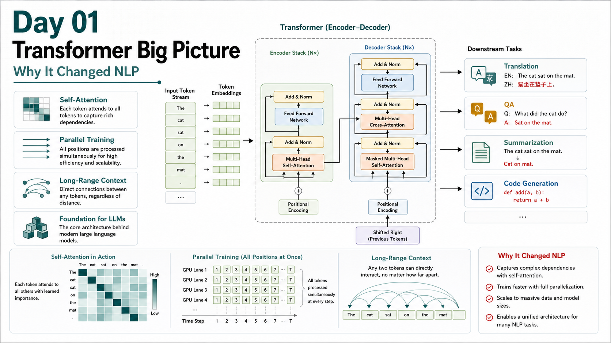
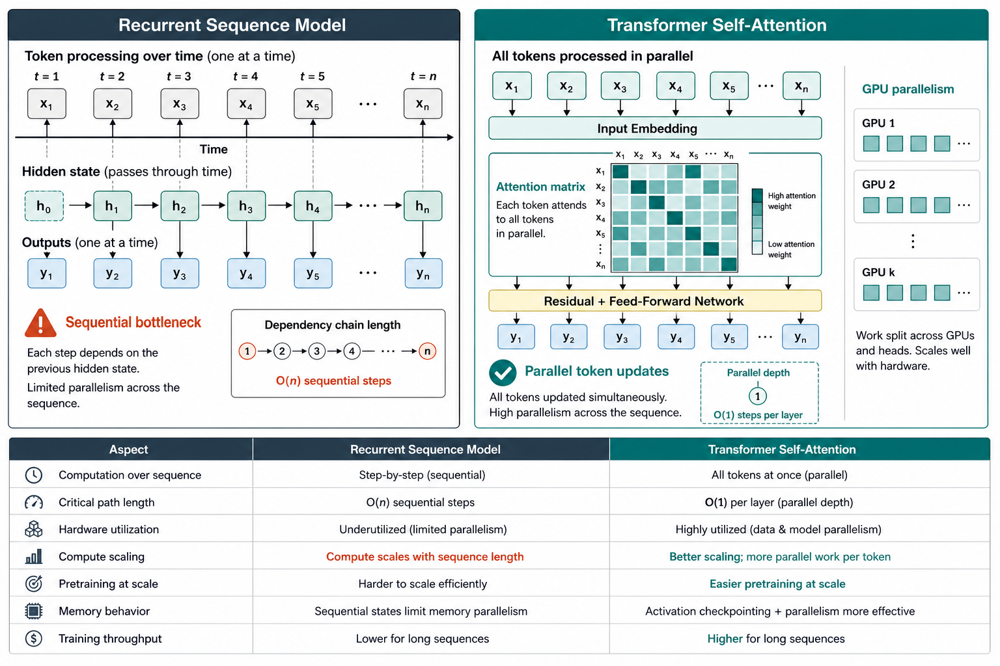
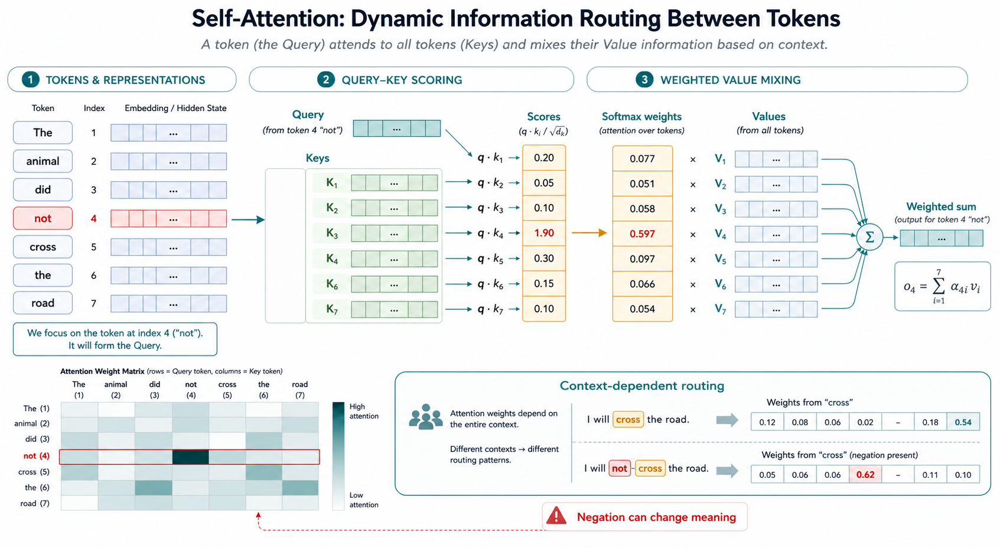
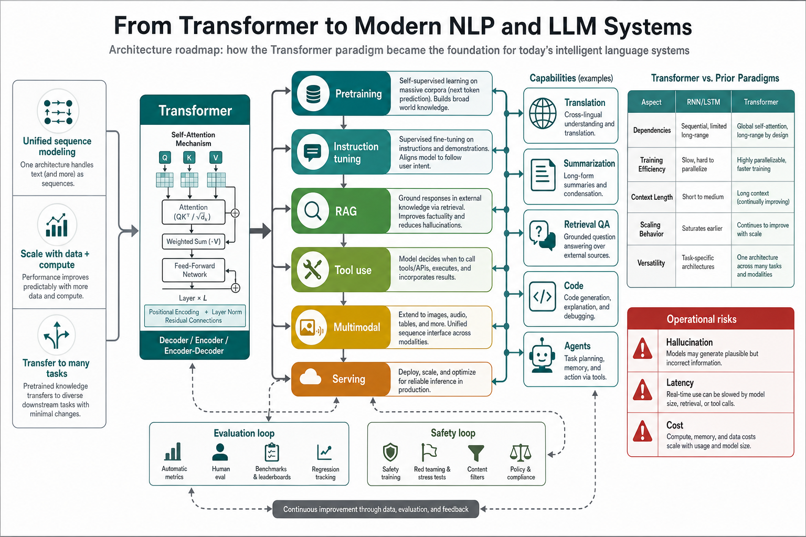
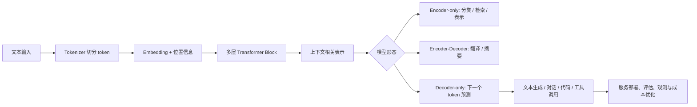

# Day 01 - Transformer 全景：为什么它改变了 NLP

日期：2026-06-23  
编号：Day 01  
主题：Transformer 的整体结构、历史动机与大模型学习主线

## 学习目标

完成今天的学习后，你应该能够回答五个问题：第一，Transformer 解决了传统序列模型的哪些核心瓶颈；第二，self-attention 为什么不是普通的“加权平均”，而是一种依赖输入内容的动态信息路由；第三，encoder-decoder、encoder-only、decoder-only 三类结构分别适合什么任务；第四，为什么 Transformer 更容易吃下大数据、大算力和大参数；第五，今天的概念如何连接后续 34 天里的 token、预训练、解码、KV cache、RAG、微调、量化和部署。

今天不要急着背完整结构图。更好的学习方式是先抓住一句话：Transformer 把“逐步读句子”的序列处理，改造成“所有位置同时交换信息”的可并行计算图。这个改变看似只是模型结构的变化，实际影响了整个 NLP 工程链路：训练吞吐提高了，长距离依赖更直接了，预训练可以扩展到更大语料了，模型学到的通用表示也更容易迁移到翻译、摘要、问答、代码和多轮对话等任务。

## 直觉解释：从流水线到信息交换网络

在 Transformer 普及之前，很多序列模型依赖 RNN、LSTM 或 GRU。它们的思想很自然：从左到右读 token，把历史信息压进隐藏状态，再把隐藏状态传给下一步。这个结构像一条流水线，适合描述时间顺序，但也有两个问题。第一，后面的 token 必须等前面的状态算完，训练时很难充分并行；第二，距离很远的信息要穿过很多步隐藏状态，容易被压缩、稀释或遗忘。

Transformer 的思路更像会议桌：句子里的每个 token 都有一张名片，也都可以查看其他 token 的名片，然后决定从谁那里拿多少信息。比如“我没有通过测试”和“我通过测试”只差一个“没有”，但语义完全不同。self-attention 允许“通过”这个位置直接关注“没有”，而不是等待某个单一路径把否定信息一层层传过来。

上图展示了关键差别：循环模型的关键路径随序列长度增长，而 Transformer 的每一层可以并行更新所有 token。注意，这不代表 Transformer 没有代价。attention 矩阵会随着序列长度增长而变大，后续我们讲上下文长度、KV cache、PagedAttention 和推理优化时，会不断回到这个代价。

## 核心概念总表

| 概念 | 初学者应先记住的解释 | 为什么重要 | 后续会连接到 |
|---|---|---|---|
| Token | 模型处理文本的离散单位 | 决定输入长度、费用和上下文占用 | Day 02、Day 07 |
| Embedding | token 的向量表示 | 让离散文本进入可计算空间 | Day 02 |
| Positional Encoding | 给 token 注入位置信息 | attention 本身不天然知道顺序 | Day 02 |
| Self-Attention | 每个 token 按内容选择关注其他 token | 解决动态依赖与长距离信息传递 | Day 03 |
| Multi-Head Attention | 多组 attention 并行看不同关系 | 让模型同时捕捉语法、指代、局部和全局关系 | Day 04 |
| FFN | 对每个位置做非线性特征变换 | 增加表达能力，不只做信息搬运 | Day 04 |
| Residual + LayerNorm | 稳定深层网络训练 | 让模型可以堆得更深、更大 | Day 04 |
| Decoder-only | 只看左侧上下文并预测下一个 token | GPT 类模型和文本生成的核心 | Day 05 |

这张表的重点不是把术语一次性学完，而是建立坐标系。后面的每天都会把一个格子展开：今天看全景，明天从 token、embedding 和位置编码进入输入表示，Day 03 再把 attention 公式拆开。

## Self-Attention 的最小公式

Transformer 最经典的公式来自 scaled dot-product attention：

$$
\mathrm{Attention}\left(Q,K,V\right)
=
\mathrm{softmax}\left(\frac{QK^{\top}}{\sqrt{d_k}}\right)V
$$

可以把它拆成四步理解。第一，当前 token 生成 query，表示“我想找什么信息”；第二，所有 token 生成 key，表示“我能被怎样检索”；第三，query 和 key 做相似度打分，得到每个位置的重要性；第四，softmax 把分数变成权重，再对 value 做加权求和。这里的 value 是真正被汇入当前 token 表示的信息。

如果输入序列是 $x_1,\ldots,x_n$，某一层里第 $i$ 个位置的输出可以粗略写成：

$$
z_i
=
\sum_{j=1}^{n}
\alpha_{ij} v_j,
\quad
\alpha_{ij}
=
\frac{
\exp\left(q_i k_j^{\top} / \sqrt{d_k}\right)
}{
\sum_{r=1}^{n}\exp\left(q_i k_r^{\top} / \sqrt{d_k}\right)
}
$$

这条公式有一个很实用的工程含义：模型不是把整句压成一个固定向量，而是在每一层、每一个位置上重新计算“应该从哪里拿信息”。所以 attention weight 既不是人工规则，也不是永远稳定的解释。它会随输入、层数、head 和训练目标变化。初学者可以用它做直觉观察，但不要把某个 attention 热力图直接等同于模型完整推理过程。

## 为什么它真的改变了 NLP

Transformer 的影响不只在学术论文里。它改变 NLP，主要因为四件事同时成立。

第一，它让训练更适合现代硬件。GPU 和 TPU 擅长大矩阵并行计算，而不是一步一步等待隐藏状态传递。Transformer 把许多序列依赖转化为矩阵乘法，使大规模预训练更现实。

第二，它让同一套结构可以迁移到很多任务。过去常见做法是为翻译、分类、问答、摘要分别设计模型或特征。Transformer 之后，很多任务可以统一成“输入一段序列，输出表示或继续生成序列”。这为后来的预训练语言模型、指令微调和通用聊天模型铺平了路。

第三，它让扩展规律变得更清楚。数据、参数量和计算量增加时，模型能力往往能持续提升。扩展并不是魔法，它依赖稳定结构、可并行训练、高质量数据和合理目标函数。Transformer 正好满足了这些条件。

第四，它把 NLP 从“特定任务系统”推向“基础模型平台”。今天我们讨论 RAG、agent、tool calling、function calling、VLM、多模态文档理解，本质上都在复用 Transformer 之后形成的通用序列建模范式。

## 三种常见 Transformer 形态

| 形态 | 注意力方式 | 典型代表 | 更适合的任务 | 初学者观察点 |
|---|---|---|---|---|
| Encoder-Decoder | encoder 双向看输入，decoder 自回归生成输出 | 原始 Transformer、T5 类思路 | 翻译、摘要、输入到输出的转换 | 输入理解和输出生成分工清楚 |
| Encoder-only | 双向 attention，输出表示 | BERT 类模型 | 分类、检索、序列标注、句向量 | 更像“理解器”，不天然逐字生成 |
| Decoder-only | masked attention，只看当前位置之前的 token | GPT 类模型 | 对话、续写、代码、工具调用 | 下一个 token 预测直接支撑生成 |

今天的大模型学习路线会重点围绕 decoder-only 展开，因为主流聊天模型和本地生成式模型大多沿着这条线发展。不过 encoder-only 并没有消失。做 embedding、检索、reranking、分类时，它仍然很常见。一个工程上成熟的判断是：不要把“能聊天”当成所有任务的唯一解。检索和排序常常需要专门的表示模型，生成才交给 LLM。

## Mermaid 全景流程

这张流程图也对应本课程的学习节奏：先理解输入如何进入模型，再理解 Transformer block 如何更新表示，然后理解 decoder-only 如何生成文本，最后进入数据、评估、RAG、微调和部署。

## 一个具体例子：为什么“长距离依赖”重要

看两个句子：

1. “小明把书放进箱子，因为它太旧了。”
2. “小明把书放进箱子，因为它太小了。”

两个句子里的“它”可能指向不同对象。人类会结合“旧”和“书”、“小”和“箱子”的常识来判断。模型如果只靠固定窗口或单向压缩状态，很容易丢掉远处细节。self-attention 至少提供了一条直接路径：当前位置可以对“书”“箱子”“旧”“小”等 token 同时打分，并在多层、多 head 中组合语法和语义线索。

当然，Transformer 不等于真正理解世界。它可以学习到强大的统计模式，却仍会在常识、事实更新、数字推理、长文一致性和罕见领域知识上犯错。这也是为什么后面要学习评估、RAG、工具调用和安全测试。架构解决了可扩展学习的问题，但不自动保证答案总是正确。

## 实践小实验：手动画一个注意力表

今天的 mini-lab 不需要安装框架，只需要纸笔或表格软件。

- 选一句 8 到 12 个 token 的短句，例如“我没有通过测试，但我知道原因”。
- 把每个 token 放在表格的行和列上，形成一个 $n \times n$ 矩阵。
- 选择一个目标 token，例如“通过”，手动标出它应该关注哪些 token。
- 给每个被关注 token 写一句理由：语法关系、否定关系、主题关系、时间关系或指代关系。
- 再换一个目标 token，例如“原因”，比较关注模式如何变化。
- 最后写下一个观察：如果序列很长，attention 矩阵会变大，这会怎样影响显存和推理速度？

这个练习的价值在于把“注意力”从抽象名词变成可检查的路由表。后面你看 attention heatmap、KV cache、上下文窗口或长文本优化时，会更容易理解它们在优化什么。

## 操作启发：初学者应该检查什么

学习 Transformer 时，建议养成四个检查习惯。第一，看到结构图时先问数据形状：输入是 token id、embedding 还是 hidden state？矩阵维度是否能相乘？第二，看到速度优化时先问瓶颈：训练瓶颈、推理瓶颈、显存瓶颈是不是同一个东西？第三，看到“模型理解了”时先问证据：是 benchmark、人工样例、可重复测试，还是单次聊天印象？第四，看到新工具时先问它位于链路哪里：tokenizer、训练、推理引擎、量化、API 服务、监控，还是应用编排？

这些问题会贯穿整个 35 天路线。比如 Day 10 的 KV cache 主要服务推理效率，不是训练技巧；Day 13 的 RAG 主要解决外部知识接入，不是让模型参数永久记住新文档；Day 21 的量化主要压缩数值表示，不是无损提升智力；Day 24 和 Day 26 的 vLLM、SGLang 主要是服务与调度系统，不是新的基础模型。

## 常见误区

1. 把 attention 当成完整解释。Attention 权重能帮助观察信息流，但模型还包含 FFN、残差连接、层归一化和多层组合，不能只看一张热力图就断言模型“为什么”回答。
2. 认为 Transformer 天然适合无限长上下文。标准 attention 的计算和存储会随序列长度明显增长，长上下文需要位置编码、缓存、稀疏化、分页管理或工程调度等额外设计。
3. 把 encoder 和 decoder 混为一谈。理解任务、生成任务和序列转换任务的目标不同，模型形态也会不同。
4. 只看参数量。架构、数据质量、训练目标、上下文长度、推理策略和工具链都会影响最终表现。
5. 忽略失败模式。Transformer 可以流畅地产生错误答案，尤其是在事实缺失、提示含糊、检索污染或长链推理时。

## 术语表

| 术语 | 简明解释 |
|---|---|
| Sequence Modeling | 对 token 序列进行建模，预测标签、表示或后续 token |
| Self-Attention | 同一序列内部的 token 彼此计算相关性并交换信息 |
| Query | 当前 token 用来检索信息的向量 |
| Key | 每个 token 用来被匹配的向量 |
| Value | 每个 token 真正贡献给输出的信息向量 |
| Softmax | 把分数转换为概率式权重的函数 |
| Masked Attention | 屏蔽未来位置，避免生成模型偷看答案 |
| Encoder | 偏向理解输入并产生上下文表示的模块 |
| Decoder | 偏向按顺序生成输出 token 的模块 |
| Pretraining | 在大规模数据上学习通用模式的训练阶段 |

## 小测

1. 为什么循环序列模型在长序列训练时并行性较差？
2. Self-attention 中 query、key、value 分别可以用什么直觉来理解？
3. Transformer 为什么仍然需要位置信息？
4. Encoder-only 和 decoder-only 在任务目标上有什么差异？
5. 为什么说 Transformer 让“大规模预训练”更现实，但不保证模型永远正确？

## 明日预告

Day 02 会进入“输入表示”的地基：tokens、embeddings 和 positional encoding。我们会解释一句中文如何被 tokenizer 切成模型可处理的编号，embedding 如何把编号变成向量，位置编码为什么必要，以及词表大小、切分粒度、上下文长度和成本之间有什么取舍。

## References

- Vaswani et al., [Attention Is All You Need](https://arxiv.org/abs/1706.03762)
- Jay Alammar, [The Illustrated Transformer](https://jalammar.github.io/illustrated-transformer/)
- Harvard NLP, [The Annotated Transformer](https://nlp.seas.harvard.edu/annotated-transformer/)
- Hugging Face, [Transformer models](https://huggingface.co/learn/nlp-course/chapter1/4)
