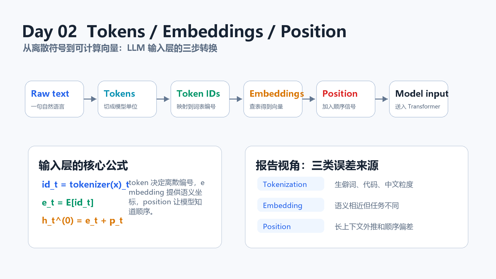
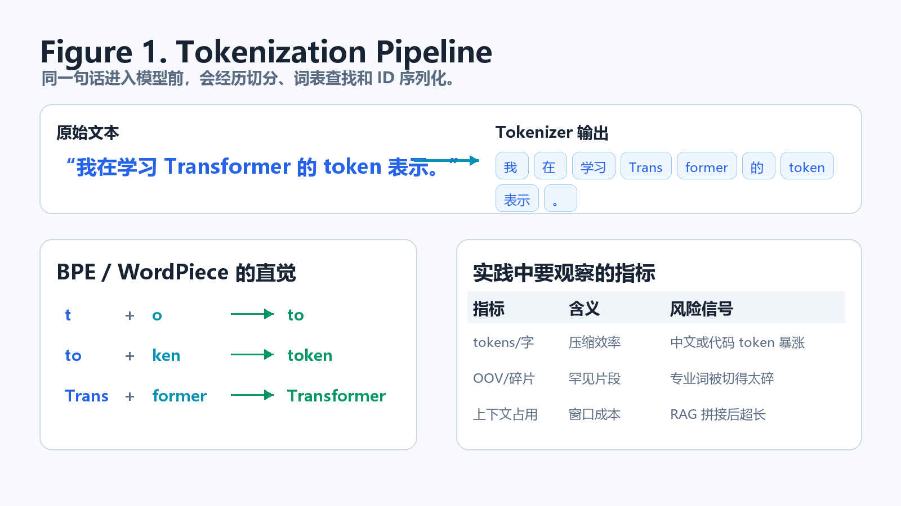
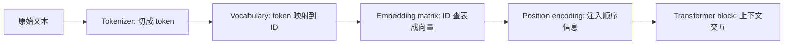
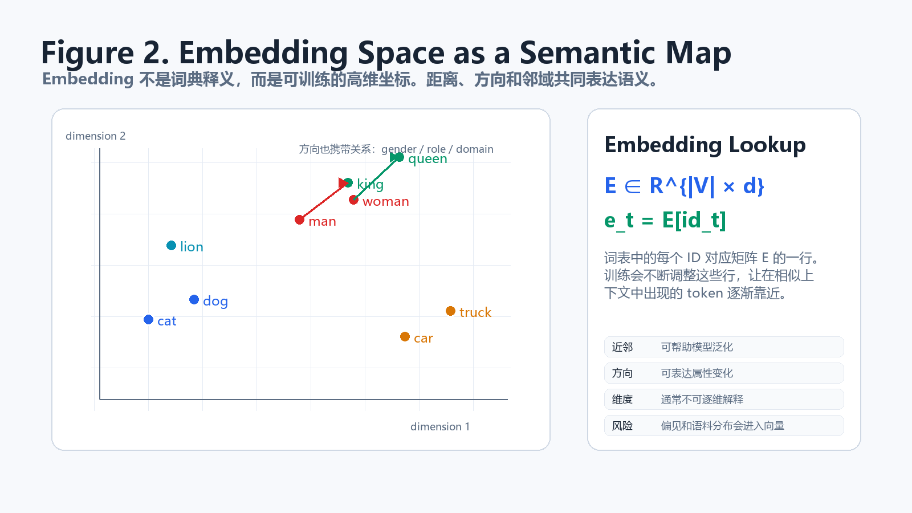
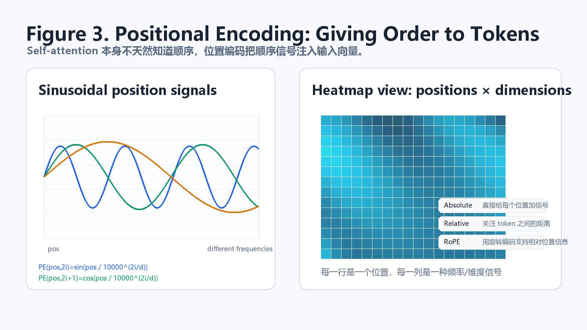
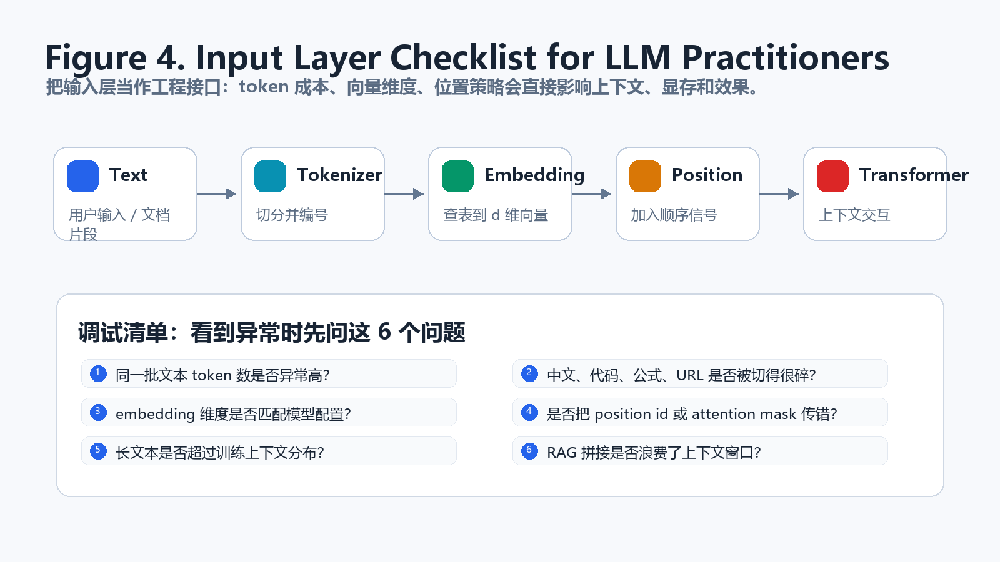

# Day 02 - Token、Embedding 与位置编码：LLM 输入层的三步转换

日期：2026-06-22  
编号：02  
主题：从离散文本到 Transformer 可计算的输入向量

## 学习目标

今天我们进入大模型的“入口层”。完成这一课后，你应该能说清楚三件事：第一，为什么模型不能直接读取自然语言，而要先把文本切成 token；第二，为什么 token ID 本身没有语义，必须通过 embedding 矩阵变成向量；第三，为什么 Transformer 还需要位置编码，否则 self-attention 会很难区分“我爱你”和“你爱我”。

这一课看似基础，却会影响后面几乎所有工程问题：上下文窗口为什么会被吃掉，RAG 为什么拼接太多文档会变贵，中文和代码为什么 token 数可能暴涨，微调时为什么 tokenizer 不能随便换，长上下文模型为什么要特别关心 position strategy。换句话说，输入层不是“预处理小细节”，而是 LLM 系统的第一个工程接口。

## 一句话总览

一个文本输入进入 Transformer 前，通常会经历下面这条路径：

可以用三行公式先建立直觉：

$$
\mathrm{tok}(x)=(u_1,u_2,\ldots,u_n)
$$

$$
z_t=\mathrm{vocab}(u_t), \quad \mathbf{e}_t=E_{z_t}
$$

$$
\mathbf{h}^{(0)}_t=\mathbf{e}_t+\mathbf{p}_t
$$

这里 $u_t$ 是第 $t$ 个 token，$z_t$ 是它在词表中的整数 ID，$E$ 是 embedding 矩阵，$\mathbf{e}_t$ 是 token 的语义向量，$\mathbf{p}_t$ 是位置向量。最终进入第一层 Transformer 的不是文字，而是 $\mathbf{h}^{(0)}_t$ 这样的连续向量。

## Token：模型真正看到的基本单位

Token 不是天然语言学概念，而是模型工程中的折中。中文里一个 token 可能是一个字、一个词，也可能是词的一部分；英文里一个 token 可能是完整单词，也可能是前缀、后缀或空格加单词；代码、URL、数学符号、罕见人名常常会被切成更多碎片。

| 对象 | 人类看到的单位 | tokenizer 可能切出的单位 | 工程影响 |
|---|---|---|---|
| 中文句子 | 字、词、短语 | 单字、常见词、标点 | 粒度影响上下文消耗 |
| 英文句子 | 单词 | 空格前缀、词根、后缀 | 同一单词大小写可能不同 |
| 代码 | 标识符、符号 | 子串、缩进、括号 | token 数经常偏高 |
| URL/日志 | 字符串片段 | 大量碎 token | RAG 和日志分析成本变高 |
| 专业术语 | 领域词 | 罕见片段组合 | 领域微调时要特别检查 |

为什么不直接按字切？因为词表太小会让序列变长，计算成本上升；为什么不直接按词切？因为词表会巨大，而且新词、拼写变化、代码符号很难覆盖。BPE、WordPiece、SentencePiece 这类方法的共同目标，是在“词表大小”和“序列长度”之间做平衡。

一个非常实用的检查方法是：拿同一批样本文本，统计字符数、token 数和 tokens/字符比例。对于中文知识库、代码仓库、论文 PDF 抽取文本，这个比例比你想象得更重要。因为后续 self-attention 的计算和 KV cache 的占用都跟 token 数直接相关。

## Embedding：把离散 ID 变成语义坐标

Token ID 只是一个整数。ID 1024 并不天然比 ID 1023 更“接近”，也不表示更高级。模型需要一个可训练矩阵 $E$，把每个 ID 映射到 $d_{\mathrm{model}}$ 维向量：

$$
E \in \mathbb{R}^{|\mathcal{V}| \times d_{\mathrm{model}}}
$$

$$
\mathbf{e}_t=E_{z_t}
$$

如果词表大小是 $|\mathcal{V}|$，隐藏维度是 $d_{\mathrm{model}}$，那么 embedding 矩阵就有 $|\mathcal{V}| \times d_{\mathrm{model}}$ 个参数。训练过程中，模型会根据上下文预测任务不断调整这些向量。经常出现在相似语境中的 token，往往会在向量空间里形成相近区域；某些语义关系也会表现为方向上的规律。

但这里要小心一个误区：embedding 不是人类词典，也不是每个维度都有清晰解释。它更像一张高维坐标地图，近邻、方向和局部结构有意义，但单独拿出第 37 维说“它代表情绪”通常是不靠谱的。做工程时，我们更关心 embedding 是否能支持下游任务，而不是强行解释每个维度。

| 观察角度 | 你能得到什么 | 不要过度解读什么 |
|---|---|---|
| 最近邻 | 相似词、同类实体、常见搭配 | 不等于严格同义词 |
| 向量方向 | 某些属性变化或关系变化 | 不等于稳定逻辑规则 |
| 聚类结构 | 领域、语言、格式的分布 | 不等于模型完全理解 |
| 异常点 | 罕见词、脏数据、编码问题 | 不等于单个 token 有错 |

## 位置编码：让模型知道顺序

Self-attention 的强大之处，是每个 token 可以关注序列里的其他 token；但如果只看一组 embedding，模型天然更像在处理一个“集合”，而不是一条有顺序的句子。为了让模型知道第 1 个 token、第 20 个 token、第 2000 个 token 的区别，我们需要位置编码。

经典 Transformer 使用正弦位置编码：

$$
\mathrm{PE}_{\mathrm{pos},2i}
=\sin\left(\frac{\mathrm{pos}}{10000^{2i/d_{\mathrm{model}}}}\right)
$$

$$
\mathrm{PE}_{\mathrm{pos},2i+1}
=\cos\left(\frac{\mathrm{pos}}{10000^{2i/d_{\mathrm{model}}}}\right)
$$

这个设计可以理解成：每个位置都会得到一组不同频率的波形信号。低频维度变化慢，能表达较长范围的位置；高频维度变化快，能区分近距离位置。现代 LLM 中还会见到 RoPE、ALiBi、相对位置编码等方案，它们背后的共同问题是：如何让模型在有限训练长度内学到顺序，并尽量泛化到更长上下文。

位置编码也是长上下文模型的关键之一。你可能见过“支持 128K 上下文”的模型，但支持长窗口不等于长窗口里每个位置都同样可靠。越长的上下文越考验位置策略、训练数据分布、注意力实现、RAG 片段排序和评估方法。

## 输入层和工程成本的关系

输入层的三步转换会直接影响后续成本：

| 输入层因素 | 影响的系统指标 | 典型问题 |
|---|---|---|
| token 数 | prompt 成本、延迟、KV cache 显存 | RAG 拼接太多，回答变慢 |
| 词表覆盖 | 专业术语、代码、数学公式处理 | 领域词被切碎，效果不稳定 |
| embedding 维度 | 参数量、显存、吞吐 | 模型越宽，矩阵计算越重 |
| 位置策略 | 长上下文能力、顺序理解 | 长文档中后段信息被忽略 |
| attention mask | 可见性和因果约束 | 训练或推理时信息泄漏 |

后面学 KV cache 时你会看到，生成第 $t$ 个 token 时，模型需要复用前面 token 的 key/value。也就是说，输入 token 越多，缓存越大，显存压力越高。后面学 RAG 时你也会看到，检索到的文档不是越多越好，因为每个片段都要占 token budget。

## Mini-lab：手动检查一段文本的输入层

今天的小实验可以不依赖 GPU。你只需要选择任意 tokenizer，例如 Hugging Face 的 tokenizer 工具，做下面四件事：

1. 选三类文本：中文自然语言、Python 代码、包含 URL 的日志。
2. 分别统计字符数和 token 数，记录 tokens/字符比例。
3. 观察专业词、变量名、URL 被切成了几个 token。
4. 修改文本中的空格、大小写、标点，观察 token 序列是否变化。

记录模板如下：

| 文本类型 | 字符数 | token 数 | tokens/字符 | 观察 |
|---|---:|---:|---:|---|
| 中文段落 |  |  |  | 是否接近字粒度 |
| Python 代码 |  |  |  | 缩进和变量名是否碎片多 |
| URL/日志 |  |  |  | 特殊符号是否导致 token 暴涨 |

如果你以后做 RAG，这个实验尤其重要。很多“检索效果差”不是 embedding 模型坏了，而是 PDF 抽取文本、表格、页眉页脚、URL、乱码把 token budget 浪费掉了。

## 常见误区

1. 以为 token 等于词。实际 token 是 tokenizer 和词表共同定义的工程单位。
2. 以为 token ID 有大小关系。ID 是索引，不代表语义距离。
3. 以为 embedding 是固定词典。Embedding 是训练出来的参数，会带有语料分布和偏见。
4. 忽略 position id。做自定义推理、拼接缓存、长上下文实验时，position id 错了会造成隐蔽问题。
5. 只看最大上下文长度，不看有效上下文质量。能塞进去不等于模型能稳定使用。

## 术语表

| 术语 | 简明解释 |
|---|---|
| Tokenizer | 把文本切成 token，并映射到词表 ID 的组件 |
| Vocabulary | token 到整数 ID 的映射表 |
| Token ID | 模型输入层使用的离散编号 |
| Embedding matrix | 把 token ID 映射成向量的可训练矩阵 |
| Position encoding | 注入顺序信息的向量或机制 |
| RoPE | Rotary Position Embedding，用旋转方式编码相对位置信息 |
| Attention mask | 控制哪些 token 可以互相看到的掩码 |
| Token budget | 上下文窗口中可用 token 数量 |

## 小测

1. 为什么 token ID 不能直接代表语义？
2. 为什么中文、代码和 URL 的 token 数可能比普通英文句子更难预测？
3. Embedding 矩阵的形状由哪两个量决定？
4. 如果没有位置编码，self-attention 会缺少什么信息？
5. RAG 系统为什么要关心 tokens/字符比例？

## 明日预告

Day 03 会进入 self-attention 的核心：我们会从“每个 token 怎样决定看谁”讲起，把 $Q$、$K$、$V$ 的直觉、矩阵形状、softmax 权重和上下文聚合串起来。今天的 token、embedding、position 是输入材料；明天的 attention 会让这些材料真正发生上下文交互。

## References

- Vaswani et al., [Attention Is All You Need](https://arxiv.org/abs/1706.03762)
- Hugging Face, [Tokenizer summary](https://huggingface.co/docs/transformers/tokenizer_summary)
- Hugging Face, [The tokenization pipeline](https://huggingface.co/learn/nlp-course/chapter2/4)
- Su et al., [RoFormer: Enhanced Transformer with Rotary Position Embedding](https://arxiv.org/abs/2104.09864)
